# SHORKHELP

A utility for SHORK Operating Systems such as [SHORK 486](https://github.com/SharktasticA/SHORK-486) that informs about SHORK's capabilities and provides guidance.

## Screenshots

<table style="table-layout: fixed; width: 100%;">
  <tr>
    <td style="width: 50%; text-align: center;">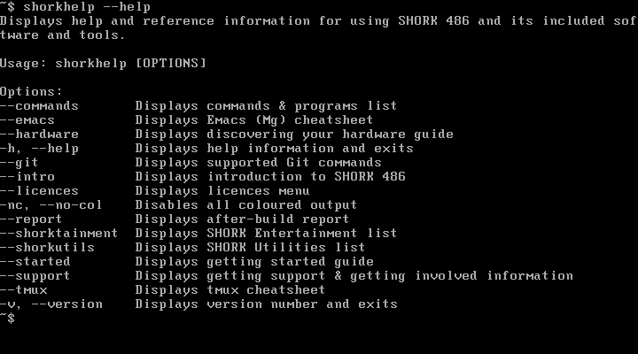</td>
    <td style="width: 50%; text-align: center;">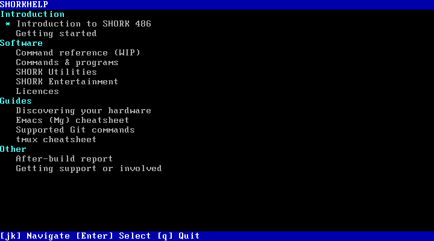</td>
  </tr>
  <tr>
    <td style="width: 50%;">--help</td>
    <td style="width: 50%;">Main menu</td>
  </tr>
</table>

<table style="table-layout: fixed; width: 100%;">
  <tr>
    <td style="width: 50%; text-align: center;">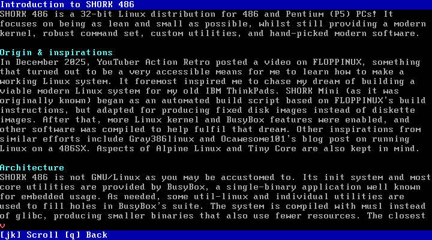</td>
    <td style="width: 50%; text-align: center;">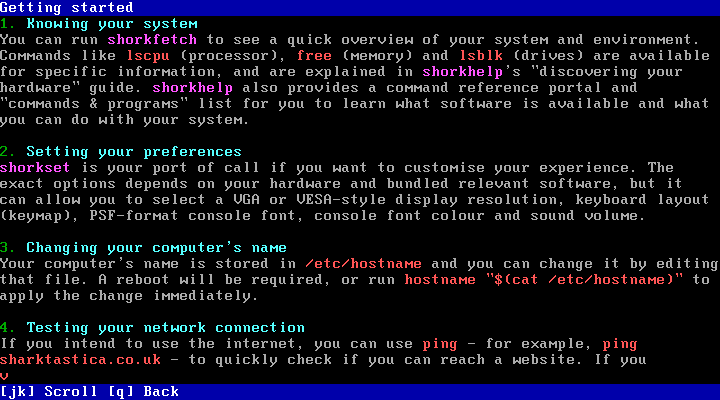</td>
  </tr>
  <tr>
    <td style="width: 50%;">Introduction to SHORK 486</td>
    <td style="width: 50%;">Getting started</td>
  </tr>
</table>

<table style="table-layout: fixed; width: 100%;">
  <tr>
    <td style="width: 50%; text-align: center;">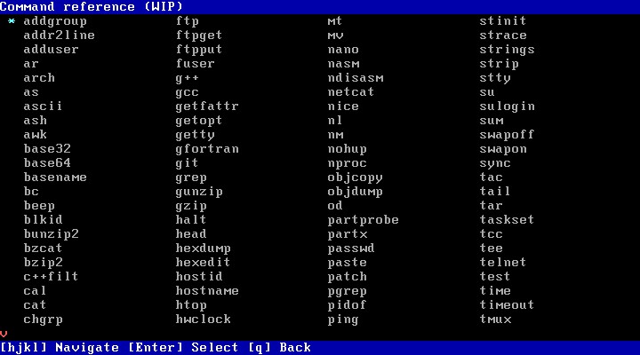</td>
    <td style="width: 50%; text-align: center;">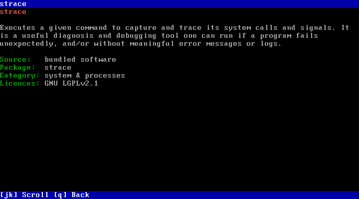</td>
  </tr>
  <tr>
    <td style="width: 50%;">Command reference (1)</td>
    <td style="width: 50%;">Command reference (2)</td>
  </tr>
</table>

<table style="table-layout: fixed; width: 100%;">
  <tr>
    <td style="width: 50%; text-align: center;">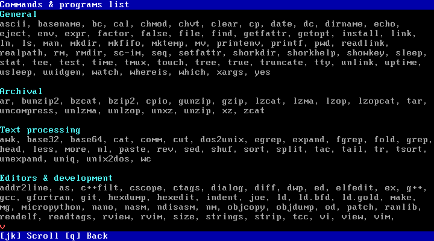</td>
    <td style="width: 50%; text-align: center;">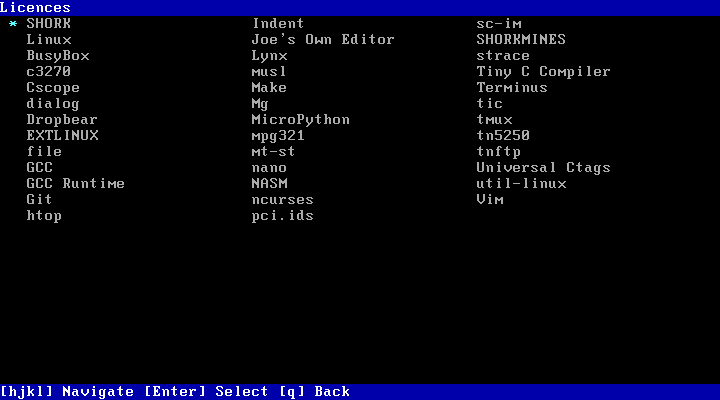</td>
  </tr>
  <tr>
    <td style="width: 50%;">Commands & programs list</td>
    <td style="width: 50%;">Licences</td>
  </tr>
</table>

<table style="table-layout: fixed; width: 100%;">
  <tr>
    <td style="width: 50%; text-align: center;">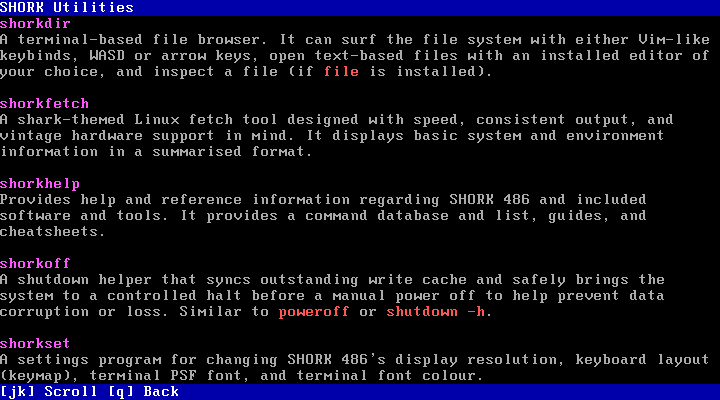</td>
    <td style="width: 50%; text-align: center;">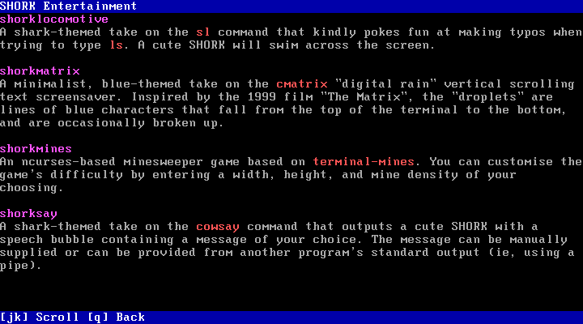</td>
  </tr>
  <tr>
    <td style="width: 50%;">SHORK Utilities</td>
    <td style="width: 50%;">SHORK Entertainment</td>
  </tr>
</table>

<table style="table-layout: fixed; width: 100%;">
  <tr>
    <td style="width: 50%; text-align: center;">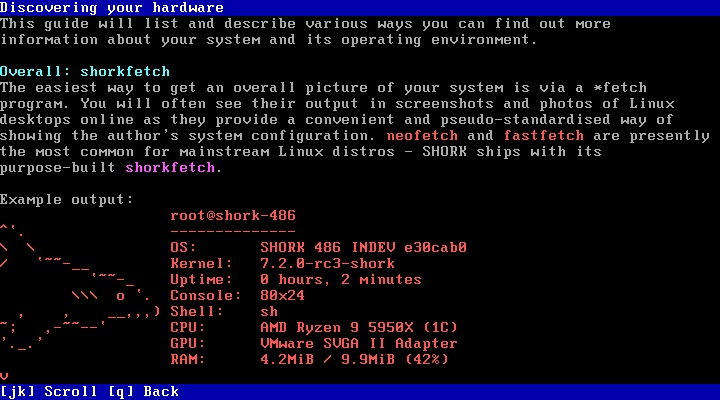</td>
    <td style="width: 50%; text-align: center;">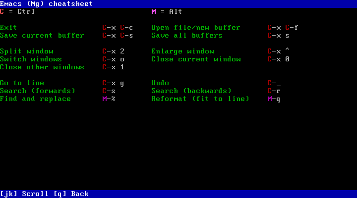</td>
  </tr>
  <tr>
    <td style="width: 50%;">Discovering your hardware</td>
    <td style="width: 50%;">Emacs (Mg) cheatsheet</td>
  </tr>
</table>

<table style="table-layout: fixed; width: 100%;">
  <tr>
    <td style="width: 50%; text-align: center;">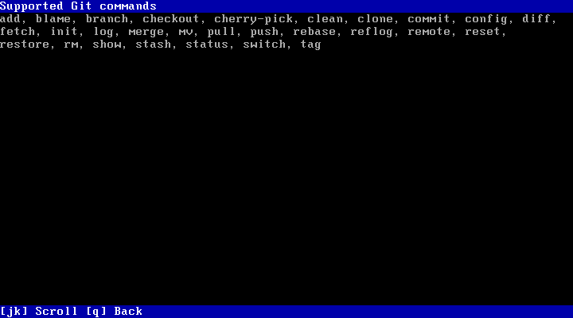</td>
    <td style="width: 50%; text-align: center;">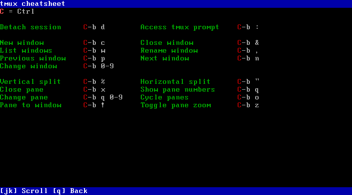</td>
  </tr>
  <tr>
    <td style="width: 50%;">Supported Git commands</td>
    <td style="width: 50%;">tmux cheatsheet</td>
  </tr>
</table>

<table style="table-layout: fixed; width: 100%;">
  <tr>
    <td style="width: 50%; text-align: center;">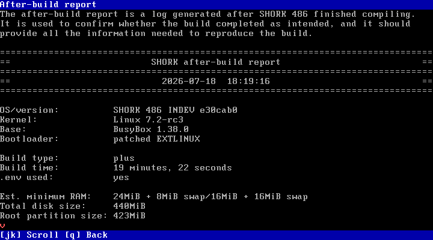</td>
    <td style="width: 50%; text-align: center;">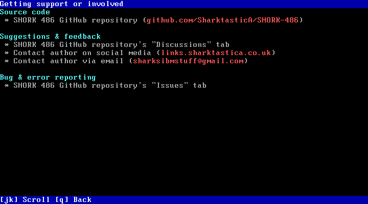</td>
  </tr>
  <tr>
    <td style="width: 50%;">After-build report</td>
    <td style="width: 50%;">Getting support or involved</td>
  </tr>
</table>
